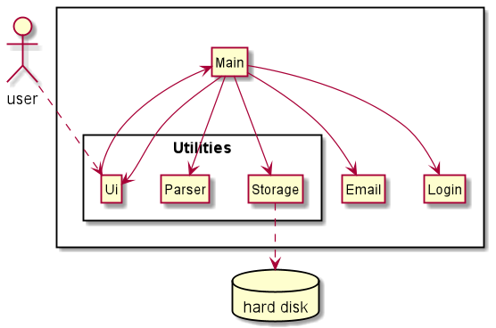
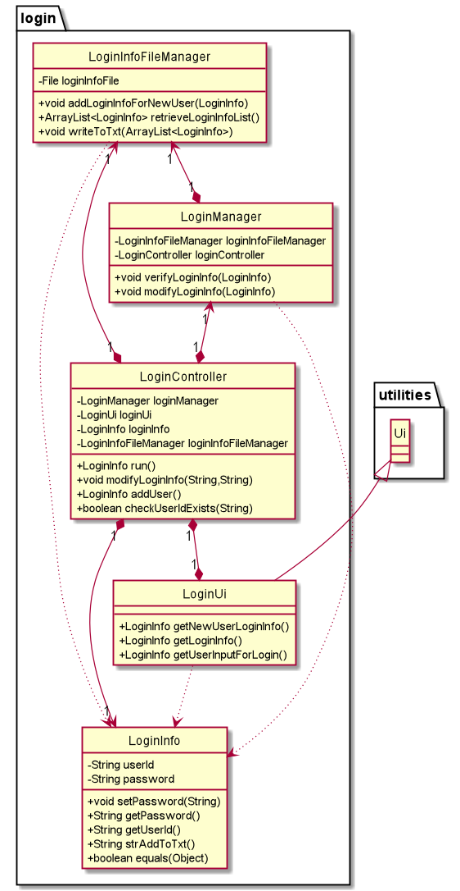

# Developer Guide

## Design

{Describe the design and implementation of the product. Use UML diagrams and short code snippets where applicable.}

### Login Component
The login component consists of the classes that run the main functions of the Login user Interface

The **Login Class Diagram** give above shows how the classes in the Login Component interact with each other

The Login Component consists of 5 components.
* <code> LoginController </code> The LoginController handles the login process and control logic of the login process.
* <code> LoginManager </code> The LoginManager provides the logic to verify the user login details
* <code> LoginUi </code> The LoginUi defines the display and gets input from the user. LoginUi extends the functionality of the Ui class
* <code> LoginInfo </code> The LoginInfo contains the atrributes and methods of each LoginInfo object from a particular user logging into MojoHR application
* <code> LoginInfoFileManager </code> The LoginInfoFileManager is responsible for the logic that handles the storage and retrieval of login information

## Implementation

### ListCommand 
There are seven variations of the <code> list </code> command.
1. List by All email(s)
2. List by Archived email(s) 
3. List by Deleted email(s)
4. List by Draft(s) email(s) 
5. List by Inbox email(s)
6. List by Junk email(s)
7. List by Sent email(s)

blah blah

The sequence diagram shows how the <code> list(type) </code> operation work. 

## Product scope

### Target user profile

{Describe the target user profile}

### Value proposition

{Describe the value proposition: what problem does it solve?}

## User Stories

|Version| As a ... | I want to ... | So that I can ...|
|--------|----------|---------------|------------------|
|v1.0|new user|see usage instructions|refer to them when I forget how to use the application|
|v2.0|user|find a to-do item by name|locate a to-do without having to go through the entire list|

## Non-Functional Requirements

{Give non-functional requirements}

## Glossary

* *glossary item* - Definition

## Instructions for manual testing

{Give instructions on how to do a manual product testing e.g., how to load sample data to be used for testing}
