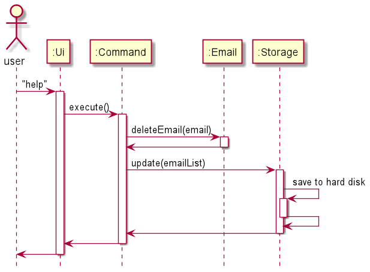
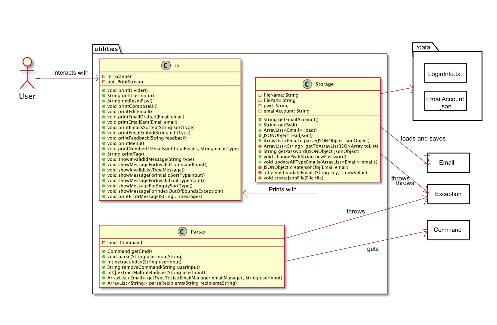
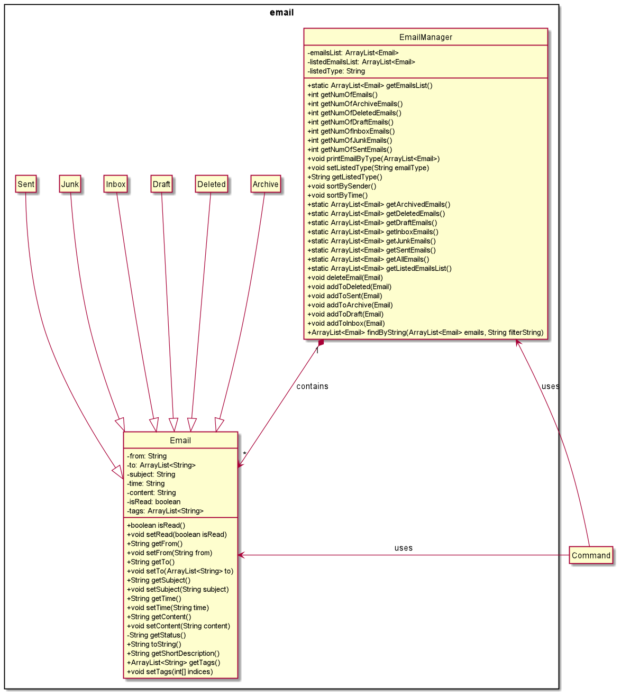
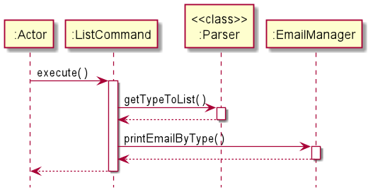
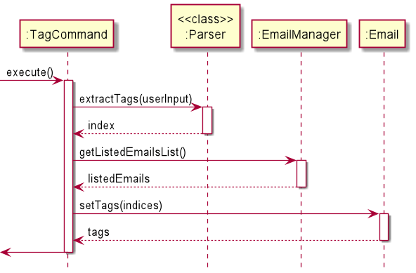
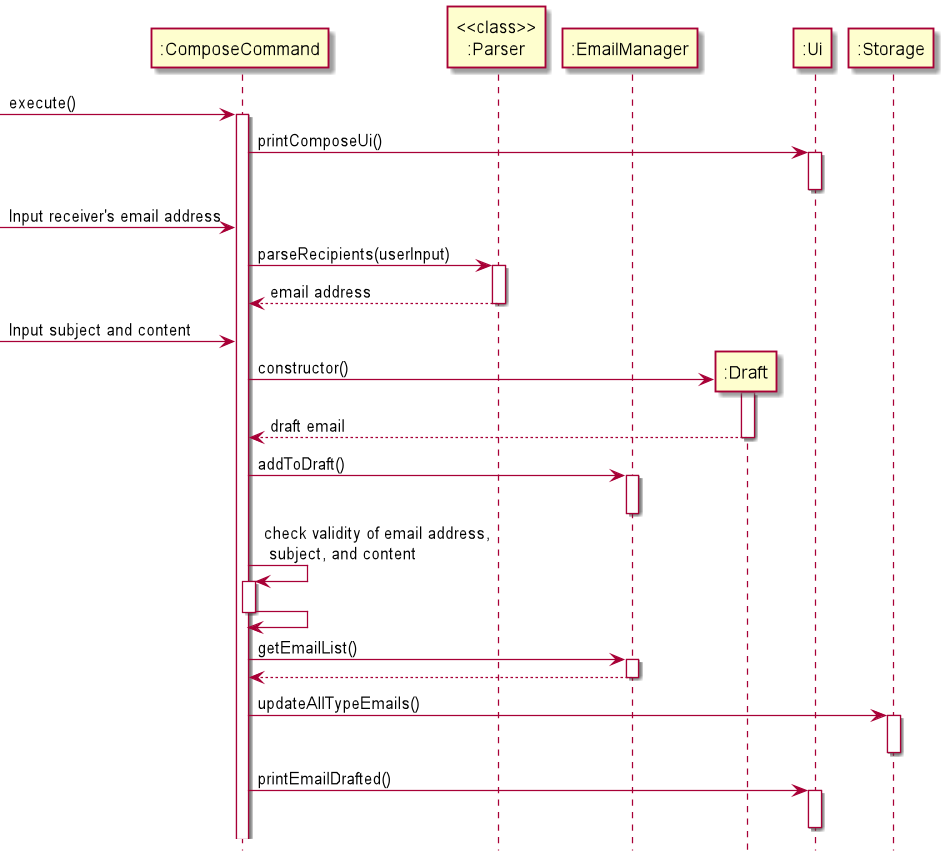
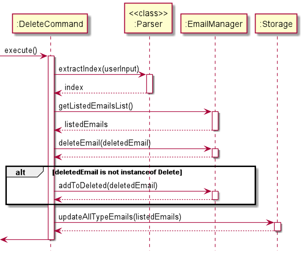

# MojoHr Developer Guide

## Content Page

1. [Design](#Design)
    1. [Architecture](#architecture)
    1. [Utilities Component](#utilities-component)
    1. [Login Component](#login-component)
    1. [Email Component](#email-component)
1. [Implementation](#implementation)
    1. [ListCommand](#listcommand)
    1. [TagCommand](#tagcommand)
    1. [ComposeCommand](#composecommand)
    1. [DeleteCommand](#deletecommand)

1. [Product Scope](#product-scope)
    1. [Target User Profile](#target-user-profile)
    1. [Value Proposition](#value-proposition)
1. [User Stories](#user-stories)
1. [Non-Functional Requirements](#non-functional-requirements)
    1. [Performance and Scalability](#performance-and-scalability)
    1. [Portability and Compatibility](#portability-and-compatibility)
    1. [Reliability, Availability, Maintainability](#reliability-availability-maintainability)
    1. [Security](#security)
    1. [Usability](#usability)
1. [Glossary](#glossary)
1. [Instructions for Manual Testing](#instructions-for-manual-testing)
    1. [Log into System](#log-into-system)
    1. [Register New User](#2-register-new-user)
    1. [Exit Application](#3-exit-application)
    1. [Find Emails by Keyword](#4-find-emails-by-keyword)
    1. [Reset the Password](#5-reset-the-password)
    1. [Compose an Email](#6-compose-an-email)

## Design

### Architecture


The Architecture Diagram above gives an overview of the different components in the application. Details of the
individual components are given below.

Mojo class controls the overall logic for the application. It is responsible for

* At app launch: Initializes the components in the correct sequence, and connects them up with each other.
* At shut down: Shuts down the components and invokes cleanup methods where necessary.

The rest of the App consists of 4 components:

* Login: Links the user to their account.
* Email: Stores and manages the user's email.
* Utilities: Consists of Ui, Storage and Parser helper class. Ui interacts with the user. Storage reads data from, and
  writes data to the hard disk. Parser parse user's input into instructions that can be understood by the application.
* Command: In charge of executing the user's request.

For these four components,

* The Login component exposes its functionality through the LoginController class.
* The Email component exposes its functionality through the EmailManager class
* The Utilities component consists of Ui, Storage and Parser classes.
* The Command component exposes its functionality through different command classes that inherit from a base Command
  class.

**How the architecture components interact with each other**

The Sequence Diagram below shows how the components interact with each other where the user issues the command `send 1`


The sections below give more details of each component.

### Utilities Component

The Utilities component contains the main classes that run the main functions of Mojo.



The Utilities Class Diagram given above shows how the classes in the Utilities component interact with each other and
classes from other component.

The Utilities Component consists for 3 classes.

* `Parser`: Breaks down user input into relevant objects.
* `Storage`: Reads data from, and writes data to, the local disk.
* `Ui`: Handles the input and output of the application.

### Login Component

The login component consists of the classes that run the main functions of the Login user interface.

The **Login Class Diagram** give above shows how the classes in the Login Component interact with each other

The Login Component consists of 5 components.

* <code> LoginController </code> The LoginController handles the login process and control logic of the login process.
* <code> LoginManager </code> The LoginManager provides the logic to verify the user login details
* <code> LoginUi </code> The LoginUi defines the display and gets input from the user. LoginUi extends the functionality of the Ui class
* <code> LoginInfo </code> The LoginInfo contains the attributes and methods of each LoginInfo object from a particular user logging into MojoHR application
* <code> LoginInfoFileManager </code> The LoginInfoFileManager is responsible for the logic that handles the storage and retrieval of login information

### Email Component

The email component consists of classes that are involved with all the emails

The **Login Class Diagram** give above shows how the classes in the Email Component interact with each other

The Email Component consists of 8 components.

* <code> Email </code> is the parent class to the other email classes and contains all the information that is required in an email
* <code> Archive </code> inherits from Email
* <code> Deleted </code> inherits from Email
* <code> Draft </code> inherits from Email
* <code> Inbox </code> inherits from Email
* <code> Junk </code> inherits from Email
* <code> Sent </code> inherits from Email
* <code> EmailManager </code> is responsible for the logic of retrieving Emails as a whole

## Implementation

### ListCommand

There are seven variations of the <code> list </code> command.

1. List by All email(s)
2. List by Archived email(s)
3. List by Deleted email(s)
4. List by Draft(s) email(s)
5. List by Inbox email(s)
6. List by Junk email(s)
7. List by Sent email(s)

The sequence diagram shows how the <code>list (type)</code> operation work.



### TagCommand

`TagCommand` allows the user to tag a specific email with a number of tags.

The sequence diagram shows how the <code> tag </code> operation work.


### ComposeCommand

When the `compose` command is entered, the software will prompt user to enter the necessary details and save them to
draft.

The details needed are receiver email, subject and content. The time the draft was composed would be saved
automatically.

The sequence diagram roughly shows how the `compose` operation works.


### DeleteCommand
`delete INDEX` allows the user to delete a specific email and move it to the delete folder

The sequence diagram shows how the <code> delete </code> operation work.


## Product Scope

### Target User Profile

Busy HR Personnel

### Value Proposition

The HR department receives many emails from job seekers. A large portion of their day is spent clearing emails. Thus,
our product seeks to allow the user to clear emails more efficiently by streamlining the process. This will reduce the
time spent on clearing emails and allow HR personnel to focus on more productive things
(from clearing emails to classifying important emails).

## User Stories

|Version| As a ... | I want to ... | So that I can ...|
|--------|----------|---------------|------------------|
|v1.0|new user|see usage instructions|refer to them when I forget how to use the application|
|v1.0|beginner|list all emails that I received, sent, draft etc|track my emails easily|
|v1.0|beginner|delete emails|it can reduce clutter|
|v1.0|beginner|archive emails|it can reduce clutter|
|v1.0|beginner|compose emails|send/reply to others|
|v1.0|beginner|count number of emails inbox|have a general idea about my total emails|
|v1.0|beginner|mark email as read after opening the email|distinguish the read and unread emails easily|
|v2.0|new user|register an account|log into MojoHR|
|v2.0|beginner|log into my account|check my emails|
|v2.0|medium user|edit my drafts|create a new draft and delete the previous one when the draft is wrong|
|v2.0|medium user|tag emails by self-defined tags|group related emails together and find them easily|
|v2.0|medium user|sort emails by the sender|find all the emails sent by my supervisor|
|v2.0|medium user|find emails by keywords|get what email I want more efficiently|
|v2.0|expert user|send messages in bulk|finish more tasks more quickly|
|v2.0|expert user|reset the password|change the password to whatever I want|

## Non-Functional Requirements

### Performance and Scalability

* Constraint: Multi-User

The product allows user to choose to log in to different accounts upon start up of software

* Constraint: Typing-Preferred

The software is targeted for user who prefers typing as means of input

### Portability and Compatibility

* Constraint: Platform-Independent

The software is runnable on the Windows, Linux, and OS-X platforms.

* Constraint: Java-Version

The software is written and tested in Java 11.

### Reliability, Availability, Maintainability

Constraint: No-Remote-Server Remote server is not needed for the current version of software

### Usability

It is easy to use the product. There is a user guide provided for users to familiarise themselves with the product.

## Glossary

* *json file* -  A file that stores simple data structures and objects in JavaScript Object Notation (JSON) format. 
In this software, it is used to store details of an email account.

## Instructions for manual testing

This section explains the instructions on how to test the app manually. Testers are advised to use
the account "12312@gmail.com" as the UserGuide and DeveloperGuide uses examples from this email account.

:information_source: **Note:** These instructions only provide a starting point for testers to work on; testers are
expected to do more *exploratory* testing.

### Launch and shutdown

1. Ensure that Java 11 is installed.
2. Download the latest version of `MojoHR` from [here](https://github.com/AY2021S2-CS2113-W10-2/tp/releases/latest).
3. Copy the jar file to the folder you want to use as the home folder for `MojoHR`.
4. Open your Command Line Terminal in the folder where the jar file is located, and run it with `java -jar Mojo.jar`.
5. Type the command in the command box and press Enter to execute it. e.g. typing `list archive`
   and pressing Enter will show the list of archived emails.
6. To terminate the app, use the `bye` command. Interrupt the Command Line Terminal with `Ctrl+C`
   or closing the terminal is also allowed.

### Log into System

#### 1. Login

##### Test case 1.0 : When correct login information is provided

Logs into the system when correct email address and password is provided by the user

**Test case**:

Enter choice: `1`

Enter email address: `12312@gmail.com`

Enter password: `5678`

Expected:

```` Hello! I'm MojoHR
  _________   _____   _____   _____
 |  _   _  | |  _  | |_   _| |  _  |
 | | | | | | | | | |   | |   | | | |
 | | | | | | | |_| |  _| |   | |_| |
 |_| |_| |_| |_____| |___|   |_____|
 What can I do for you?
 > Use the keyword "LIST (type) " to print the emails by types
!!! type must be one of: [allemails, inbox, archive, deleted, draft, junk, sent]!!!
 > Use the keyword "READ (index) " to open the selected email
 > Use the keyword "COMPOSE " to create a draft email
 > Use the keyword "SEND (index of draft) " to send email in the draft folder
 > Use the keyword "DELETE (index) " to delete the selected email
 > Use the keyword "FIND (keyword) " to find the  email by keywords
 > Use the keyword "ARCHIVE (index) " to move the selected email to the archive folder
 > Use the keyword "TAG (index)" to select the email for tagging labels
 > Use the keyword "RESET" to reset the your account password
 > Use the keyword "HELP" to print the menu
 > Use the keyword "BYE" to exit
 ____________________________________________________________
 Enter Command: 
````

##### Test case 1.1: When wrong login information is provided

When wrong email address and password is provided by the user

**Test case**

Enter choice: `1`

Enter email address: `abc`

Enter password: `000`

Expected:

```
!!!!!!!!!!!!!!!!!!!!!!!!!!!!!!!!!!!!!!!!!!!!!!!!!!!!!!!!!!!
 Error Message: 
 Wrong UserID and/or Password. Please try again!
 !!!!!!!!!!!!!!!!!!!!!!!!!!!!!!!!!!!!!!!!!!!!!!!!!!!!!!!!!!!
```

#### 2. Register New User

##### Test case 2.0: Correctly registers a user

Registers a new user, when the formatting provided is correct

**Test case:**

Enter choice: `2`

Enter email address: `mary@gmail.com`

Enter password: `1234`

Expected:

```` Hello! I'm MojoHR
  _________   _____   _____   _____
 |  _   _  | |  _  | |_   _| |  _  |
 | | | | | | | | | |   | |   | | | |
 | | | | | | | |_| |  _| |   | |_| |
 |_| |_| |_| |_____| |___|   |_____|
 What can I do for you?
 > Use the keyword "LIST (type) " to print the emails by types
!!! type must be one of: [allemails, inbox, archive, deleted, draft, junk, sent]!!!
 > Use the keyword "READ (index) " to open the selected email
 > Use the keyword "COMPOSE " to create a draft email
 > Use the keyword "SEND (index of draft) " to send email in the draft folder
 > Use the keyword "DELETE (index) " to delete the selected email
 > Use the keyword "FIND (keyword) " to find the  email by keywords
 > Use the keyword "ARCHIVE (index) " to move the selected email to the archive folder
 > Use the keyword "TAG (index)" to select the email for tagging labels
 > Use the keyword "RESET" to reset the your account password
 > Use the keyword "HELP" to print the menu
 > Use the keyword "BYE" to exit
 ____________________________________________________________
 Enter Command: 
````

##### Test case 2.1: Incorrect Registration Format provided by a User

Error message shown, when the formatting provided is not correct

**Test case**

Enter choice: `2`

Enter email address: `hi`

Enter password: `1234`

Expected

````
!!!!!!!!!!!!!!!!!!!!!!!!!!!!!!!!!!!!!!!!!!!!!!!!!!!!!!!!!!!
Error Message: 
Please enter a valid email address! 
Email address must have "@" and cannot have empty string in front or behind
!!!!!!!!!!!!!!!!!!!!!!!!!!!!!!!!!!!!!!!!!!!!!!!!!!!!!!!!!!!
````

#### 3. Exit Application

##### Test case 3.0: Allow the user to exit the system

When the correct choice format is chosen, user will be able to exit the system

**Test case**

Enter choice: `3`

Expected:

```
Logging off... Hope to see you again in MojoHr!
```

##### Test case 3.1: Incorrect Choice Format

When an incorrect format of choice is shown, error message will be displayed

Enter choice: `three`

Expected:

```
!!!!!!!!!!!!!!!!!!!!!!!!!!!!!!!!!!!!!!!!!!!!!!!!!!!!!!!!!!!
Error Message: 
You need to enter an integer! Please try again!
!!!!!!!!!!!!!!!!!!!!!!!!!!!!!!!!!!!!!!!!!!!!!!!!!!!!!!!!!!!
```

#### 4. Find Emails by Keyword

##### Test case 4.0: Finds keyword that exist in email system

Print all emails that contains the keyword.

**Test case**:
`list allemails`

`find subject 11`

Expected:

````
1. [Deleted][UNREAD]
|| Subject: This is subject 11
|| From: 21312@gmail.com --> To: [12312@gmail.com, 12313@gmail.com, 12314@gmail.com]
|| Time: 2021-02-20T16:30:00
|| Tags: []
````

##### Test case 4.1: Finds keyword that does not exist in email system

When the keyword typed does not exist in the email system, a message will be displayed.

**Test case**:

`find school`

Expected:

`No matching emails found.`

#### 5. Reset the Password

Reset the password for the user's email account. The program will ask for the old password from user.

##### Test case 5.1: Typing old password correctly

If the old password is correct, the program will ask for the new password from user and outputs a message upon
completion

Input: `reset`

Expected: `Please enter your old password:`

Input: `5678`

Expected: 
````
Please be careful!
     * Password should not contain any space.
     * Password should contain at least one digit(0-9).
     * Password length should be between 8 to 15 characters.
     * Password should contain at least one lowercase letter(a-z).
     * Password should contain at least one uppercase letter(A-Z).
     * Password should contain at least one special character ( @, #, %, &, !, $, etc….).
Please enter your new password:
````

Input: `Aa12312-`

Expected: `Your password has changed successfully!`

Then, you can exit the program and use the new password to login.

##### Test case 5.2: Typing wrong old password for 3 times

The number of wrong attempt is 3. If the old password is wrong for 3 times, the program will output a message and return
to main menu.

Input: `reset`

Expected: `Please enter your old password:`

Input: `12312`

Expected: `Sorry your old password is wrong. Please try again!(2 times left!)`

Input: `12222`

Expected: `Sorry your old password is wrong. Please try again!(1 times left!)`

Input: `12223`

Expected: `Sorry your old password is wrong for 3 times. Go back to the main page.`

#### 6. Compose an email

Compose an email for the user which will be saved into draft upon completion. The program will ask for Receiver, Subject
and Content whereas draft time will be saved automatically

Input:

`compose`

Expected:

```
____________________________________________________________
Please enter the details below in the correct order  
To:
Subject:
Content:
You can send to multiple recipents by appending email address with ";"
e.g: Alice@gmail.com;Bob@gmail.com
You should end content by typing "/end" in a newline
____________________________________________________________
```

#### Test case 6.0: Correct input

Input:

```
correctDomain@gmail.com
testSubject
Dear Sir,

This is a test content.

regards,
user
/end
```

Expected: `Email saved to draft at 2021-04-01T13:00:00`

#### Test case 6.1: Unsupported email domain

Input:

```
wrongDomain@yaya.com
testSubject
Dear Sir,

This is a test content.

regards,
user
/end
```

Expected:

```
Warning: Incomplete email address or invalid email domain.
Supported Email domains are: [gmail.com, yahoo.com, outlook.com, hotmail.com]
____________________________________________________________
Email saved to draft at 2021-04-12T01:06:23
____________________________________________________________
```

### Saving data

Data for all accounts' email addresses and passwords are stored in `LoginInfo.txt`, whereas data of each email account
is stored in its own json file.

Details of Files:

* The json file will be automatically created when creating an account in our software.
* Each json file contains the account's email address, password, and all emails.
* Are automatically loaded when MojoHR starts.
* Are automatically updated upon commands that would cause a change in the file, such as creating an account, sending or
  deleting an email.

**Note**: Testers are not advised to manually modify any data files unless they become familiar. This is to prevent data
files from corrupting.

## Attribution

The format of this User Guide was adapted
from [AddressBook Level 3(AB3) Developer Guide](https://github.com/se-edu/addressbook-level3/blob/master/docs/DeveloperGuide.md)
.